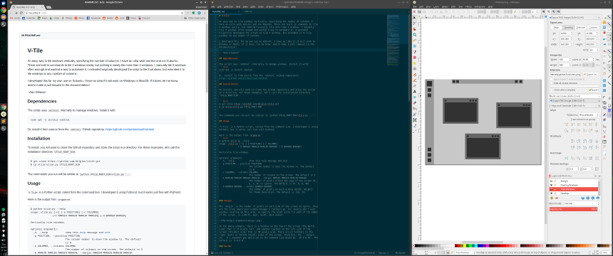
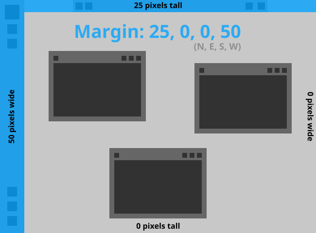
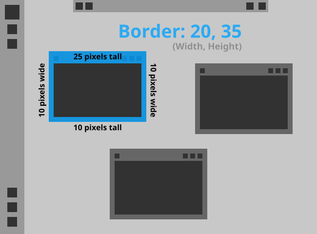
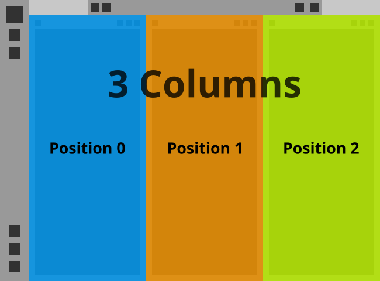

# V-Tile

An easy way to tile windows vertically, specifying the number of columns. I
have an ultra wide monitor and run Xubuntu. There are built-in commands to tile
2 windows easily, but nothing to easily tile more than 2 windows. I manually
tile 3 windows often enough and wanted a way to automate it. I extended
originally developed the script to tile 3 windows, but extended it to tile
windows to any number of columns.

I developed this for my own use on Xubuntu. I have no idea if it will work on
Windows or MacOS. If it does, let me know, and/or make a pull request to the
documentation!

\- *Dan Gleason*



## Dependencies

The script uses `xdotool` internally to manage windows. Install it with:
```bash
sudo apt -y install xdotool
```
Or, install it from source from the `xdotool` Github repository:
https://github.com/jordansissel/xdotool

## Installation

First off, install the [dependencies](#dependencies) if you haven't done so
already.

To install, you will want to clone the Github repository and store the script
in a directory. For these examples, let's call the installation directory
`VTILE_ROOT_DIR`.

```bash
$ git clone https://github.com/dnlglsn/vtile.git
$ cp vtile/vtile.py VTILE_ROOT_DIR
```

The commands you run will be similar to `python VTILE_ROOT_DIR/vtile.py ...`.

## Usage

`V-Tile` is a Python script, called from the command line. I developed it using
Python3, but it works just fine with Python2.

Here is the output from `argparse`:
```bash
$ python vtile.py --help
usage: vtile.py [-h] [-p POSITION] [-c COLUMNS]
               [-m MARGIN MARGIN MARGIN MARGIN] [-b BORDER BORDER]

Vertically tile windows.

optional arguments:
  -h, --help            show this help message and exit
  -p POSITION, --position POSITION
                        The column number to move the window to. The default
                        is 0.
  -c COLUMNS, --columns COLUMNS
                        The number of columns on the screen. The default is 3
  -m MARGIN MARGIN MARGIN MARGIN, --margin MARGIN MARGIN MARGIN MARGIN
                        The number of pixels around the edge of the screen (N,
                        E, S, W) to ignore. The default is [0, 0, 0, 40]
  -b BORDER BORDER, --border BORDER BORDER
                        The number of pixels on each window (Width, Height)
                        for theme decoration. The default is [10, 31]
```

### Margin

The `margin` is the number of pixels on each side of the screen to ignore. They
are the areas where your window manager's toolbars go. You usually don't want
windows covering up this area, so specify the pixel sizes for each of the edges
of the screen, in a North, East, South, West manner.



In the above example, there is a toolbar on the top of the screen (the North
side) that is 25 pixels tall, and another toolbar on the left side of the
screen (the West side) that is 50 pixels wide. There are no toolbars on the
right (East) or bottom (South) sides of the screen. Therefore, the `--margin`
(or `-m`) argument you would set on the command line would be: `25 0 0 50`. The
default is `0 0 0 0`.

### Border

The `border` is the amount of window decorations your window manager adds to
each window. It is where the window resize borders, title, and window icons
reside. We need to take this into account when resizing a window, as `xdotool`
doesn't know or care what window manager you are using.



In the above example, the top of each window has a 25 pixel tall area where the
title and window icons live. It also has a 20 pixel resize border around the
right, bottom, and left sides of each window. The `border` argument you would
want to set is the sum of the borders in each width and height direction. In
this example, the `border` width would be 10 + 10 = 20, and the `border` height
would be 25 + 10 = 35. Therefore, you would specify the `--border` (or `-b`)
argument on the command line as `20 35`. The default is `0 0`.

### Columns and Position

The `columns` is the number of columns you want on the screen. Each window will
fill a single column. The 'position' argument is which column position you want
the window to fill, starting from position number 0 and increasing in number
to the right.



In the example above, there are 3 columns. Therefore, you would specify the
`--columns` (or `-c`) argument on the command line to be `3`. The default
number of columns is `3`. The blue column is in position 0, specified on the
command line as `--position 0` (or `-p 0`). The orange is in position 1 and the
yellow is in position 2. The default position is `0`.

## 3 Window Setup on XFCE

Here is a step-by-step guide on installing and setting up the script to use 3
columns in XFCE.

1. Clone the Github repository, as above in the [Installation](#installation)
section.
2. Open your XFCE settings manager, by clicking on Whiskermenu and clicking on
the "All Settings" icon.
3. Click on "Keyboard" under the "Hardware" section.
4. Click on the "Application Shortcuts" tab at the top of the window.
5. Click on the "Add" button at the bottom of the window.
6. For the "Command", enter `python VTILE_ROOT_DIR/vtile.py`. Click on "Ok".
7. Enter the key shortcut you want for the leftmost column. I use
"Super+Shift+1".
8. Add another shortcut by clicking "Add" at the bottom of the window.
9. For the "Command", enter `python VTILE_ROOT_DIR/vtile.py --pos 1`. Click on
"Ok".
10. Enter the key shortcut you want for the middle column. I use
"Super+Shift+2".
11. Add another shortcut by clicking "Add" at the bottom of the window.
12. For the "Command", enter `python VTILE_ROOT_DIR/vtile.py --pos 2`. Click on
"Ok".
13. Enter the key shortcut you want for the middle column. I use
"Super+Shift+3".

> **Remember:** The VTILE_ROOT_DIR is the location where you put the `vtile.py`
script and is not set up automatically. It is just a placeholder for use
within this documentation.

There you go, now you have a 3 column setup with easy keyboard shortcuts.
